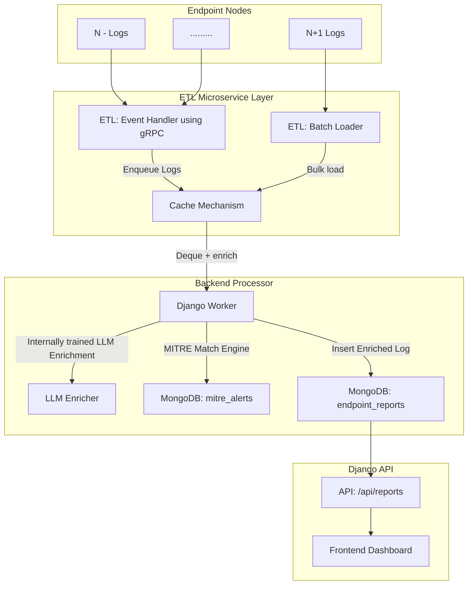
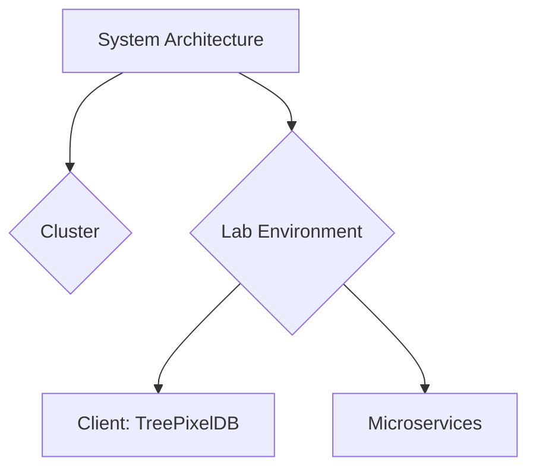

```mermaid
graph TD
subgraph Endpoint Nodes
    A1[N - Logs]
    A2[.........]
    A3[N+1 Logs]
end

subgraph ETL Microservice Layer
    A1 --> G1[ETL: Event Handler using gRPC]
    A2 --> G1
    A3 --> G2
    G1 -->|Enqueue Logs| B1[Cache Mechanism]
    G2[ETL: Batch Loader] -->|Bulk load| B1
end

subgraph Backend Processor
    B1 -->|Deque + enrich| C1[Django Worker]
    C1 -->|Internally trained LLM Enrichment| D1[LLM Enricher]
    C1 -->|MITRE Match Engine| D2[MongoDB: mitre_alerts]
    C1 -->|Insert Enriched Log| D3[MongoDB: endpoint_reports]
end

subgraph Django API
    D3 --> E1[API: /api/reports]
    E1 --> F1[Frontend Dashboard]
end
```

```mermaid
graph TD
    A[System Architecture] --> B{Cluster};
    A --> C{Lab Environment};
    C --> D[Client: TreePixelDB];
    C --> E[Microservices];

    click B "./cluster/README.md" "Go to Cluster Documentation"
    click D "./lab-env/client/TreePixelDB/README.md" "Go to Client Documentation"
    click E "./lab-env/micro_services/README.md" "Go to Microservices Documentation"
```
